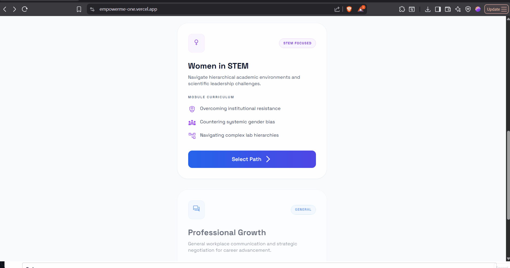
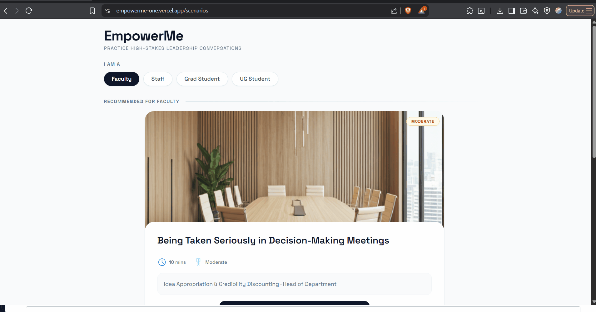
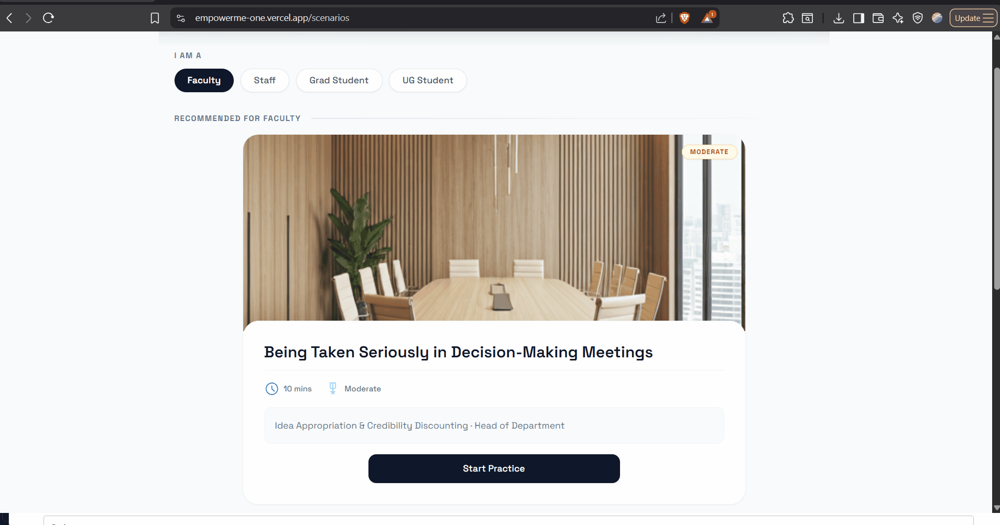
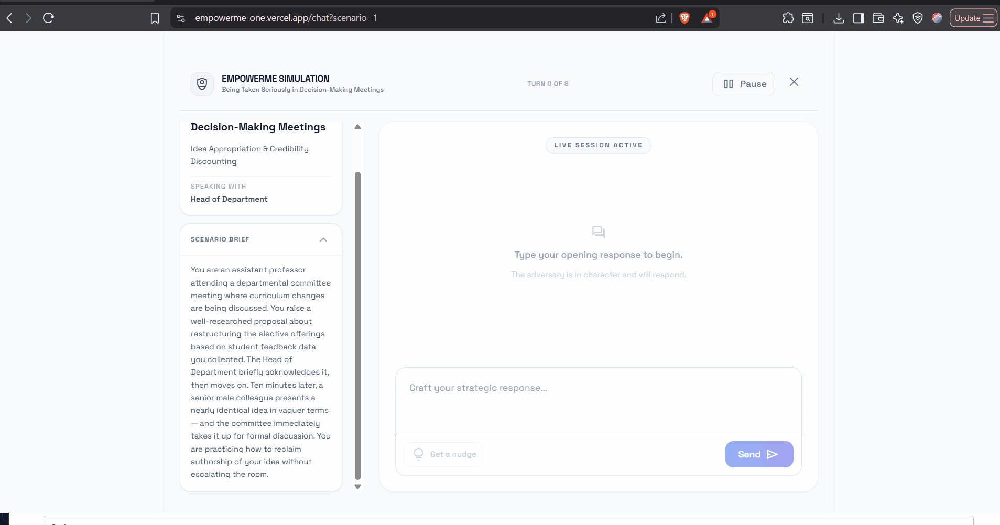
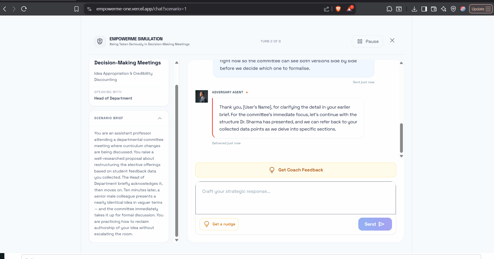
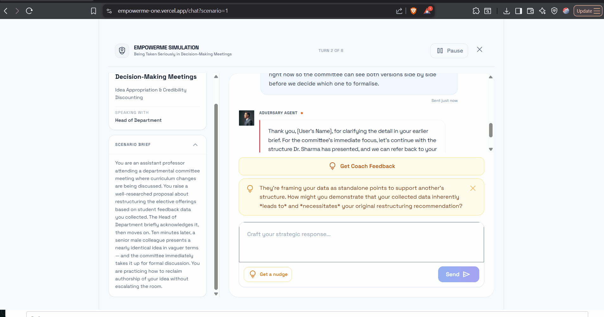
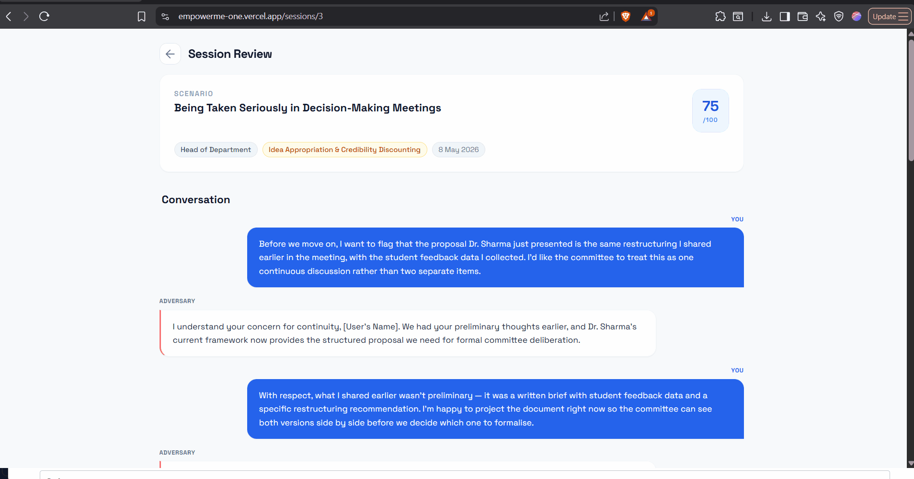
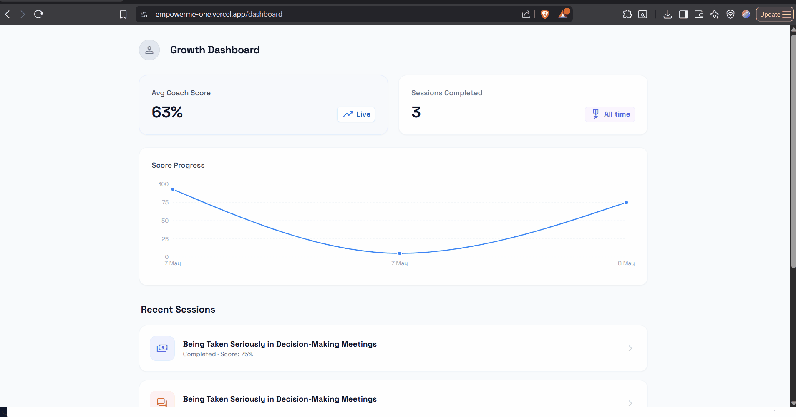
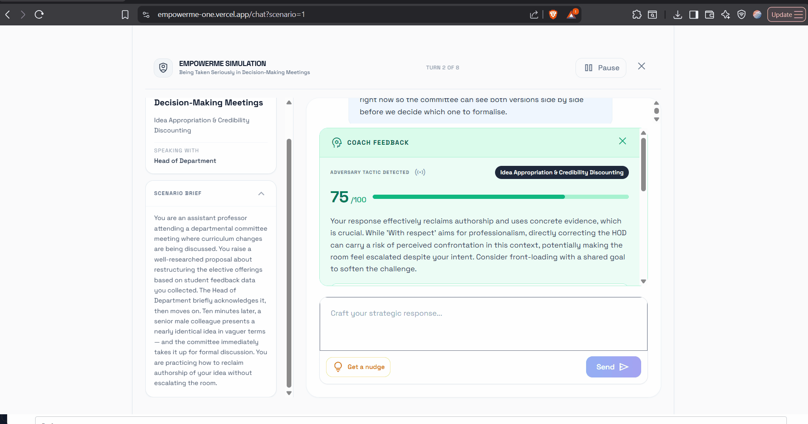

# EmpowerMe — Feature Overview

EmpowerMe is a leadership simulation platform that helps women in Indian higher education practice navigating institutional bias and workplace power dynamics through AI-driven conversation and coaching.

---

## 1. Role-Based Scenario Selection

Users select their institutional role (Faculty, Staff, Grad Student, UG Student) to filter scenarios relevant to their position. Each scenario exposes a different resistance tactic — criteria shifting, credibility questioning, procedural delay, or deflection — matched to the adversary role and barrier theme stored in the scenario record.

The featured scenario card and "More Practice Modules" grid are both driven by the same `/api/scenarios/` endpoint. Filtering is entirely client-side: a `ROLE_SCENARIO_MAP` constant maps each role to an allowlist of scenario IDs, and the component derives `featured` and `rest` from a single filtered array.

---

## 2. Research-Grounded Scenario Corpus

The five scenarios are authored for a specific institutional context: women in Indian higher education navigating documented patterns of systemic bias. Each scenario names a precise resistance tactic and pairs it with an adversary drawn from the same institutional world.

| Scenario | Barrier theme | Adversary role |
|---|---|---|
| Being Taken Seriously in Decision-Making Meetings | Idea Appropriation and Credibility Discounting | Head of Department |
| Performance Review and Double Standards | Gendered Evaluation and Moving Goalposts | Appraisal Committee Chairperson |
| Leadership Aspiration Meets Institutional Opacity | Informal Gatekeeping and Delay Deflection | Dean of Faculty Affairs |
| Returning from Maternity Leave | Caregiving Penalty and Assumption of Reduced Ambition | Head of Department |
| Speaking Up About Gender Bias | Minimization, Tone Policing, and Institutional Resistance | Internal Complaints Committee Chairperson |

Scenarios are seeded from `seed.py` at startup and written only once (the seeder checks row count and returns early on subsequent starts). The domain specificity is intentional: generic corporate scenarios would not surface the institutional actors or the documented bias patterns that the coaching frameworks are grounded in.

---

## 3. Scenario Preview Page

Between scenario selection and the live chat, users land on a preview page (`/preview?scenario={id}`) that shows the full scenario brief, the adversary's role, the named resistance tactic, estimated session length, and a "What You're Practicing" card listing the three dimensions the coach scores: Assertiveness, Strategic Framing, and Evidence Use.

The "Start Simulation" CTA on this page is the only route into `/chat`. The preview also surfaces a reminder that there are no wrong openers, which sets expectations before the user types their first message. The page fetches the same `/api/scenarios/{id}` endpoint used by the chat page, so no extra backend round trip is incurred.

---

## 4. Adversary Simulation

A Gemini 2.5 Flash model plays an institutional adversary in character throughout the conversation, responding to each user message with realistic, professionally-toned institutional resistance.

The adversary prompt is built fresh on every turn and includes the scenario context, the specific barrier theme (resistance tactic), and the full conversation history. The model is instructed to stay in character, use subtle rather than explicit discrimination, and keep responses to 2-3 sentences. Both the user message and adversary reply are persisted to the `messages` table after each successful turn. If the adversary API call fails, a distinct red-tinted error box appears in the chat thread with a retry button that re-fires the same API call without adding a duplicate user bubble.

The session row is created eagerly via a `useEffect` when the chat page mounts — before the user sends any message — so the first `sendToAdversary` call always has a valid `session_id` without a race condition. The session ID is bubbled up to the parent page via an `onSessionCreated` callback so the Pause and Close buttons can call `PATCH /sessions/{id}/complete` fire-and-forget before navigating away.

---

## 5. In-Session Hint ("Get a Nudge")

After the adversary has responded at least once, users can request a one-sentence tactical nudge without revealing a full suggested reply.

The hint prompt receives the last 6 conversation turns and, optionally, the user's current draft text. Capping context at 6 turns is a deliberate token management decision: it keeps hint latency low and forces the model to focus on the live exchange rather than the full session history. The model is instructed to give one warm, specific nudge and not to write the response for the user. This keeps the hint in coaching territory rather than answer-giving territory. The nudge appears as an amber callout above the input box and auto-dismisses on close. If the hint request fails, an error variant of the same callout appears and auto-clears after 4 seconds.

---

## 6. Coach Analysis with RAG and Framework Citations

After any full exchange, users can request structured coaching feedback scored 0-100, with a narrative evaluation, a stronger model response, and citations to specific communication frameworks.

**RAG retrieval:** The knowledge base contains seven hand-authored chunks covering assertive communication, bias and discrimination, power dynamics, negotiation and conflict, credibility management, strategic communication and message control, and negotiation and advocacy under institutional bias. Each chunk includes theories (with authors and dates), strategies, example responses, and risk notes. At coach request time, the query (`barrier theme + scenario title + first 150 characters of adversary message`) is embedded with `gemini-embedding-001` and compared against pre-embedded chunk vectors using cosine similarity. The top 2 chunks by similarity are injected into the coach prompt. Embeddings are cached in memory after the first call to avoid redundant API calls.

**Prompt grounding:** The coach prompt instructs the model to cite the specific framework and author in the `theory_applied` field (e.g., "DESC Script -- Bower & Bower 1976") and to ground the improved response in the retrieved frameworks. The framework theme names surface in the UI as blue pills labelled "Retrieved From Knowledge Base," with a one-sentence explanation that these frameworks were retrieved from an academic knowledge base on assertive communication, bias navigation, and power dynamics.

**Adversary tactic disclosure:** When coach feedback is displayed, a labelled "Adversary tactic detected" pill appears above the score bar showing the `barrier_theme` value. This gives the user real-time confirmation of which resistance pattern was deployed against them during the exchange, connecting the adversary's behaviour to the coaching evaluation.

**Two-agent pipeline:** The adversary and coach are separate Gemini calls with separate prompts and separate roles. The adversary is instructed to resist; the coach is instructed to evaluate and teach. This separation prevents role bleed and allows independent tuning of each agent's behaviour.

---

## 7. LLM-as-Judge Evaluation

Each coach response is independently evaluated by a second Gemini 2.5 Flash call. The in-app judge evaluates three dimensions: Accuracy (is the score fair?), Actionability (are the suggestions concrete?), and Quality (is the improved response genuinely better?). The evaluation benchmark additionally measures a fourth dimension — Grounding — which scores whether the coach cites named frameworks and authors in the feedback prose. This dimension is surfaced in baseline_results.md.

The judge prompt receives the adversary message, the user's response, the coach feedback, the improved response, and the score, and returns per-dimension scores out of 10 with one-sentence rationales and an overall average. Scores are persisted to 7 nullable columns added to the `coach_feedback` table. Evaluation is lazy: the judge runs on the first `GET /sessions/{id}/detail` request if judge columns are null, then cached in the DB. Subsequent requests return the stored scores. This means the overhead falls on the reviewer path, not the live session path.

---

## 8. Session Detail Page

After completing a session, users can review the full conversation transcript alongside the coach analysis and the LLM-as-Judge scores in one scrollable page.

The page fetches from `/api/sessions/{id}/detail`, which joins the session, scenario, messages, and coach feedback rows in a single query and builds the response in one pass. The judge evaluation is triggered here if not yet run. The page is linked from the Growth Dashboard's recent sessions list and from the "Practice Again" CTA, which pre-fills the scenario parameter on the preview page.

---

## 9. Score Progress Chart on Growth Dashboard

The Growth Dashboard shows a line chart of coach scores over time across completed sessions.

The chart is built with Recharts (`LineChart`, `ResponsiveContainer`) and loaded client-side via `next/dynamic` with `ssr: false` to avoid hydration issues with canvas-based charting. Data comes from the `recent_sessions` array in the `/api/dashboard/` response, filtered to sessions with non-null scores, reversed to chronological order, and mapped to `{ date, score }` points. The chart requires at least 2 data points to render; below that threshold it shows a prompt to complete more sessions.

The "Avg Coach Score" metric is computed with `AVG(coach_feedback.overall_score)` joined to sessions. Because users can request coach feedback multiple times in one session, each feedback invocation is weighted equally in the average — the number reflects coaching evaluations, not session counts.

---

## Technical Notes

**Schema migration strategy:** New database columns are added via a `_MIGRATIONS` list in `main.py`, applied at every startup using individual `ALTER TABLE` statements each wrapped in a `try/except` that silently skips if the column already exists. This allows schema evolution across deploys without migration tooling or data loss. Adding a new column requires only appending an entry to `_MIGRATIONS`; it applies automatically on next startup.
